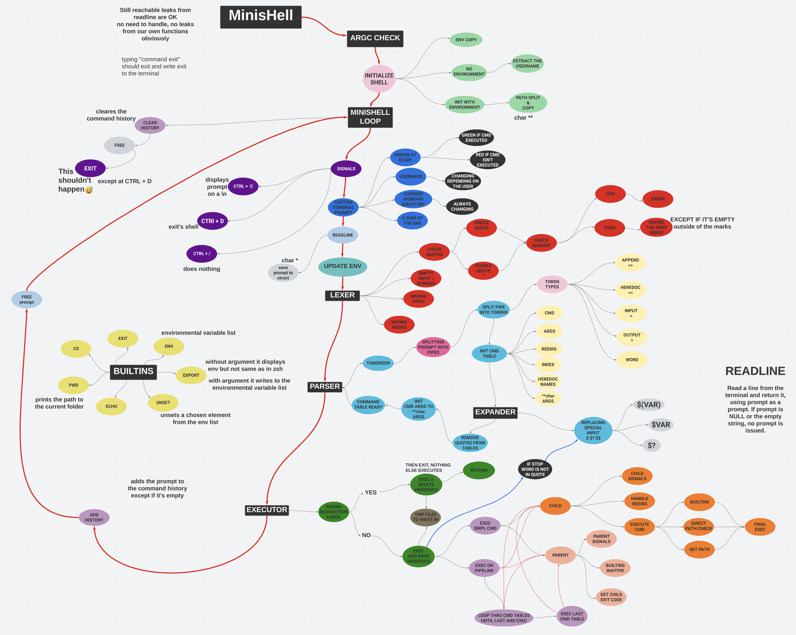

# **MINISHELL**
# Overview

# Allowed External Functions
## Print Related
### printf
NAME:
SYNOPSIS:
DESCRIPTION:
RETURN VALUE:
### write
NAME:
SYNOPSIS:
DESCRIPTION:
RETURN VALUE:
## Memory Related
### malloc
NAME:
SYNOPSIS:
DESCRIPTION:
RETURN VALUE:
### free
NAME:
SYNOPSIS:
DESCRIPTION:
RETURN VALUE:

##  File Descriptor Related
### open
NAME:
SYNOPSIS:
DESCRIPTION:
RETURN VALUE:
### read
NAME:
SYNOPSIS:
DESCRIPTION:
RETURN VALUE:
### dup
NAME:
SYNOPSIS:
DESCRIPTION:
RETURN VALUE:
### dup2
NAME:
SYNOPSIS:
DESCRIPTION:
RETURN VALUE:
### close
NAME:
SYNOPSIS:
DESCRIPTION:
RETURN VALUE:

## Readline Related
### readline
NAME:
SYNOPSIS:
DESCRIPTION:
RETURN VALUE:
### rl_clear_history
NAME:
SYNOPSIS:
DESCRIPTION:
RETURN VALUE:
### rl_on_new_line
NAME:
SYNOPSIS:
DESCRIPTION:
RETURN VALUE:
### rl_replace_line
NAME:
SYNOPSIS:
DESCRIPTION:
RETURN VALUE:
### rl_redisplay
NAME:
SYNOPSIS:
DESCRIPTION:
RETURN VALUE:
### add_history
NAME:
SYNOPSIS:
DESCRIPTION:
RETURN VALUE:

## Signal Related
### signal
NAME:
SYNOPSIS:
DESCRIPTION:
RETURN VALUE:
### sigaction
NAME:
SYNOPSIS:
DESCRIPTION:
RETURN VALUE:
### sigemptyset
NAME:
SYNOPSIS:
DESCRIPTION:
RETURN VALUE:
### sigaddset
NAME:
SYNOPSIS:
DESCRIPTION:
RETURN VALUE:

## Execution Related
### access
NAME:
SYNOPSIS:
DESCRIPTION:
RETURN VALUE:
### execve
NAME:
SYNOPSIS:
DESCRIPTION:
RETURN VALUE:
### exit
NAME:
SYNOPSIS:
DESCRIPTION:
RETURN VALUE:

## Fork Related
### fork
NAME:

    fork - create a child process

SYNOPSIS:

    #include <sys/types.h>
    #include <unistd.h>

    pid_t fork(void);

DESCRIPTION:

    fork() creates a new process by duplicating the calling process. The new process is referred to as the
    child process. The calling process is referred to as the parent process.

    The child process and the parent process run in separate memory spaces. At the time of fork() both memory
    spaces have the same content. Memory writes, file mappings and unmappings performed by one of the processes
    do not affect the other.

RETURN VALUE:

    On success, the PID of the child process is returned in the parent, and 0 is returned in the child. On
    failure, -1 is returned in the parent, no child process is created, and errno is set appropriately.

### pipe
NAME:

    pipe - create pipe

SYNOPSIS:

    #include <unistd.h>

    int pipe(int pipefd[2]);

DESCRIPTION:

    pipe() creates  a pipe, a unidirectional data channel that can be used for interprocess communication. The
    array pipefd is used to return two file descriptors referring to the ends of the pipe. pipefd[0] refers to
    the  read end of the pipe. pipefd[1] refers to the write end of the pipe. Data written to the write end of
    the pipe is buffered by the kernel until it is read from the read end of the pipe.

RETURN VALUE:

    On success, zero is returned. On error, -1 is returned, errno is set appropriately, and pipefd is left
    unchanged.

### wait
NAME:

    wait - wait for process to change state

SYNOPSIS:

    #include <sys/types.h>
    #include <sys/wait.h>

    pid_t wait(int *wstatus);

DESCRIPTION:

    The wait()  system call suspends execution of the calling thread until one of its children terminates. The
    call wait(&wstatus) is equivalent to:

    waitpid(-1, &wstatus, 0);

RETURN VALUE:

    wait(): on success, returns the process ID of the terminated child; on error, -1 is returned.

### waitpid
NAME:

    waitpid - wait for process to change state

SYNOPSIS:

    #include <sys/types.h>
    #include <sys/wait.h>

    pid_t waitpid(pid_t pid, int *wstatus, int options);
 
DESCRIPTION:

    The waitpid() system call suspends execution of the calling thread until a child specified by  pid  argument
    has  changed  state.  By default, waitpid() waits only for terminated children, but this behavior is
    modifiable via the options argument, as described below.

    The value of pid can be:

    < -1   meaning wait for any child process whose process group ID is equal to the absolute value of pid.

    -1     meaning wait for any child process.

    0      meaning wait for any child process whose process group ID is equal to that of the calling process at the time of the call to waitpid().

    > 0    meaning wait for the child whose process ID is equal to the value of pid.

    The value of options is an OR of zero or more of the constants as seen in man 2 waitpid.

RETURN VALUE:

    waitpid(): on success, returns the process ID of the child whose state has changed; if WNOHANG was specified
    and  one  or more child(ren) specified by pid exist, but have not yet changed state, then 0 is returned.  On
    error, -1 is returned.

### kill
NAME:

    kill - send signal to a process

SYNOPSIS:

    #include <sys/types.h>
    #include <signal.h>

    int kill(pid_t pid, int sig);

DESCRIPTION:

    The kill() system call can be used to send any signal to any process group or process.

    If pid is positive, then signal sig is sent to the process with the ID specified by pid.

    If pid equals 0, then sig is sent to every process in the process group of the calling process.

    If  pid  equals  -1,  then sig is sent to every process for which the calling process has permission to send
    signals, except for process 1 (init), but see below.

    If pid is less than -1, then sig is sent to every process in the process group whose ID is -pid.

    If sig is 0, then no signal is sent, but existence and permission checks are still performed;  this  can  be
    used to check for the existence of a process ID or process group ID that the caller is permitted to signal.

RETURN VALUE:

    On success (at least one signal was sent), zero is returned.  On error, -1 is returned, and errno is set appropriately.

## Other
### getcwd
### chdir
### stat 
### lstat
### fstat
### unlink
### opendir
### readdir
### closedir
### strerror
### perror
### isatty
### ttyname
### ttyslot
### ioctl
### getenv
### tcsetattr
### tcgetattr
### tgetent
### tgetflag
### tgetnum
### tgetstr
### tgoto
### tputs

## Unused
### wait3 && wait4
